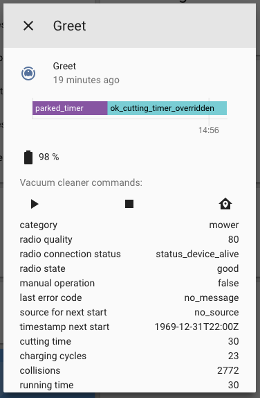

# Home assistant Gardena Smart support

Custom component to support Gardena smart devices, all device will be automatically discovered.
It uses a seperate library (also written by me), this library has additional (intersting) details in it's documentation:
https://github.com/wijnandtop/wt.pygardena

It supports the devices:

## Sileno smart mower
Mowers will be added as vacum cleaners.
The vacum cleaner is the closest thing to a lawn mower, it has characteristics like a base station, being a robot, supports simular command (stop, start, dock) and has battery status.
Start will trigger 24h of mowing.




## smart sensor 
https://www.gardena.com/int/products/smart/smart-system/gardena-smart-sensor/967044801/
Device is registered as multiple sensors:

* soil temperature (sensor as class temperature)
* soil humidity (sensor as class humidity)
* light (sensor as class illuminance)
* ambient temperature (sensor as class temperature)
* frost warning (binary_sensor as class cold)

## watering computer

Supports:
Start (triggers 30min of watering)
Stop 

!Concern, will the irrigation control break this plugin, since this implementation only assumes one outlet?

## Usage

Just copy the content of this repository to (so including the "gardena" folder)

```
[your home-assistant-path]/config/custom_components
```

Add these lines in your configuration.yml

```
gardena:
  username : !secret gardena_user
  password : !secret gardena_password
```

Of course you need to make sure you have the secrets available.
Note: this components is tested on a clean hass.io install and did work. A extra restart of hass may be needed (if you have the error "No module named 'wt'" in your logs).

##TODO

* submit component to home-assistant
    * Validate if all requirements are met 
* fetch garden image
* nice lovelace display for a garden / location

## tested with:
 
 * Mower: Sileno smart (the one with a working capacity of 1000m2)
 
## not planned yet
Since I do not own the devices.

* Smart pressure pump
* smart power adapter
* smart battery
* smart irrigation control (is on my wishlist)


